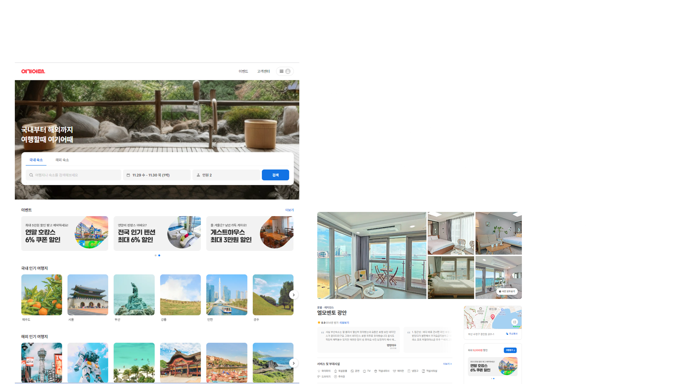
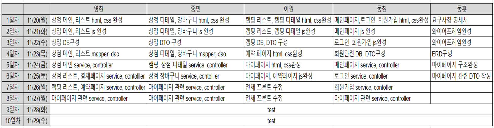
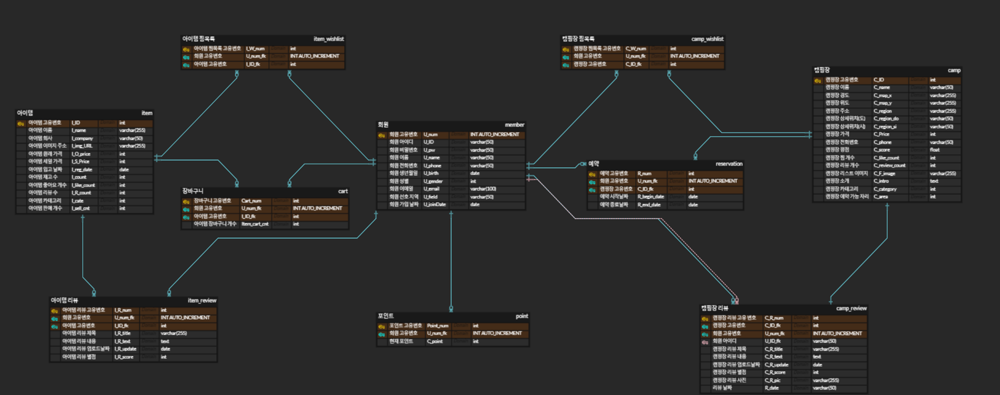
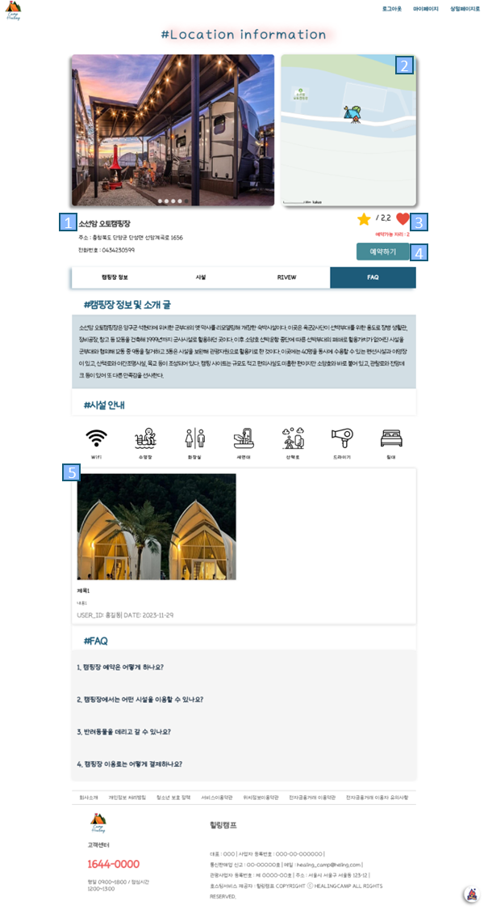
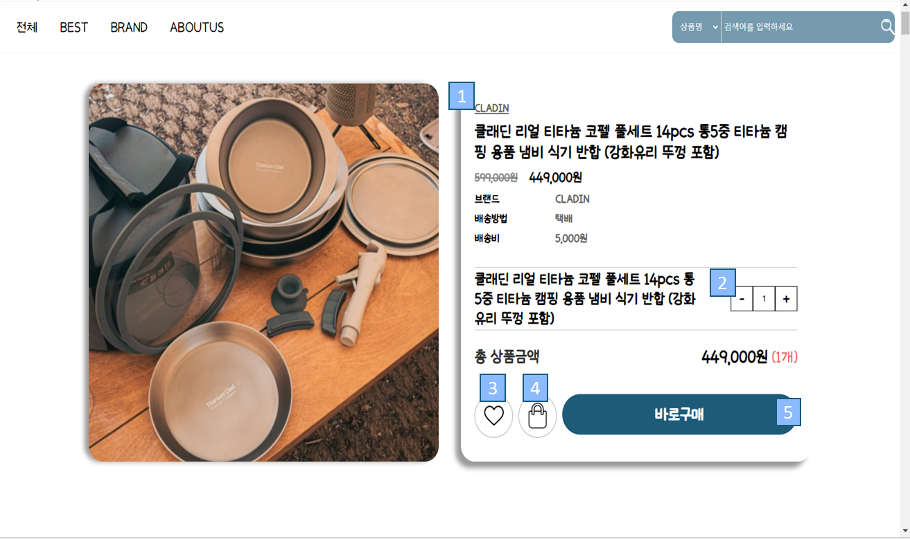
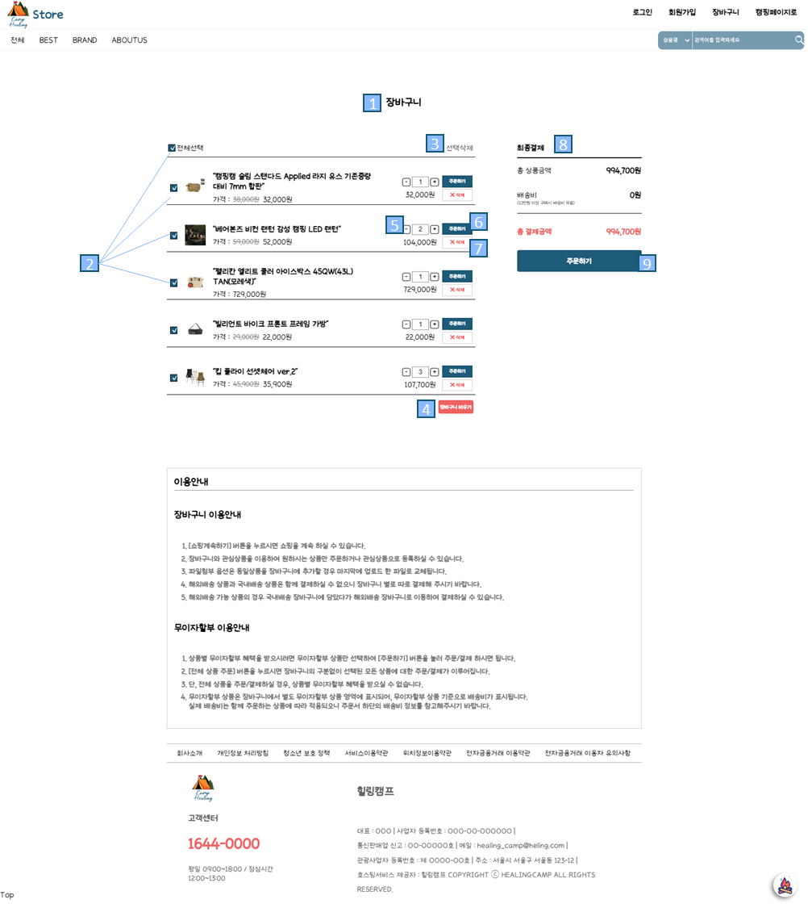
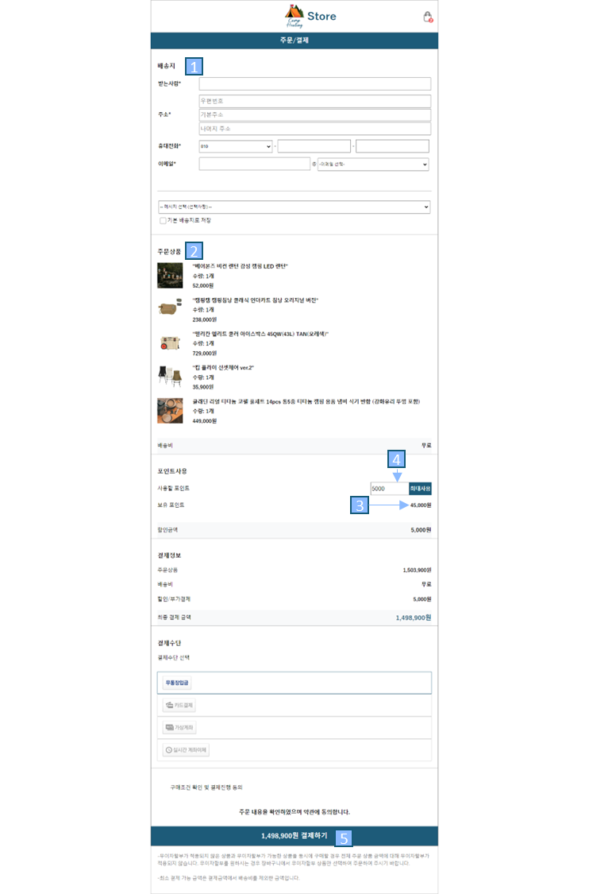

<h1>Healing Camp - 팀 프로젝트</h1>
 

 
 

## 프로젝트 목적
 

- 하나의 사이트에서 캠핑장 예약과 캠핑용품 구매가 모두 가능한 사이트 제작 

---

## 프로젝트 인원
 

- 프론트 0명, 백엔드 5명

 

---

## 프로젝트 기간
 

- 2023-11-20 ~ 2023-11-29

 

---

## 팀 개발 환경
 

- 운영체제 : Windows
- 개발도구 : Visual Studio Code, Intellij
- DB : Mysql
- Server : Apache Tomcat 9.0.82
- Language: HTML5, CSS3, JavaScript, JQuery, AJax, Java, Jstl, JSP
- FrameWork: Spring, MyBatis

 

---

## ER-다이어그램
 

 

---

## 맡은 파트
 

- <h3>캠핑장 디테일 페이지 (백엔드)</h3>
- <h3>상점 디테일 페이지 (프론트,백엔드)</h3>
- <h3>상점 장바구니 페이지 (프론트, 백엔드)</h3>
- <h3>상점 결제 페이지 (프론트)</h3>
- <h3>마이페이지 - 캠핑장, 아이템 찜 목록 (백엔드)</h3>
- <h3>마이페이지 - 리뷰작성, 수정, 삭제 (백엔드)</h3>

 

---

## **캠핑장 디테일 페이지**
 

#### 1.캠핑장 정보 표시 (사진, 이름, 주소, 전화번호, 평점, 예약가능 자리 등)
#### 2.캠핑장 지도 api
#### 3.현재 로그인한 유저의 찜상태 표시, 클릭시 찜목록에 추가/제거
- ####   비로그인시 "로그인이 필요합니다." 메세지 띄워주기
#### 4.캠핑장 예약 페이지로 이동
#### 5.해당 캠핑장 리뷰 리스트 보여줌

 

---

## **상점 디테일 페이지**
 

#### 1.상품 정보 표시 (이미지, 브랜드, 제품명, 가격 ,배송비 등)
#### 2.상품 수량 조절
#### 3.유저의 찜상태 표시, 클릭시 찜목록에 추가/제거
#### 4.클릭시 채크된 수량만큼 장바구니에 추가 or "이미 추가된 상품입니다." 메세지 띄워주기 
- #### 비로그인시 "로그인이 필요합니다." 메세지 띄워주기
#### 5.결제 페이지로 이동

 

---

## **상점 장바구니 페이지**
 

#### 1.유저의 장바구니 목록 보여주기
#### 2.전체선택, 개별선택
#### 3.선택한 상품 장바구니에서 삭제
#### 4.장바구니 비우기
#### 5.상품 수량 조절 (바로바로 장바구니 DB 수량 업데이트)
#### 6.해당상품만 주문하기
#### 7.해당상품 장바구니에서 삭제
#### 8.선택된 상품 전체 가격정보 표시
#### 9.선택된 상품들 모두 결제하기 페이지로 이동

 

---

## **상점 결제 페이지**
 

#### 1.배송지 입력
#### 2.주문상품 목록
#### 3.유저의 보유 포인트 보여주기 (사용할 포인트 입력시 입력값 만큼 빠짐)
#### 4.보유 포인트 내에서 사용할 포인트 입력, 최대사용 버튼 클릭시 모두 사용
#### 5.결제하기 (주문목록 상품들 장바구니에서 제거, 포인트 업데이트)

 

---

## **마이페이지**
 

 

---

